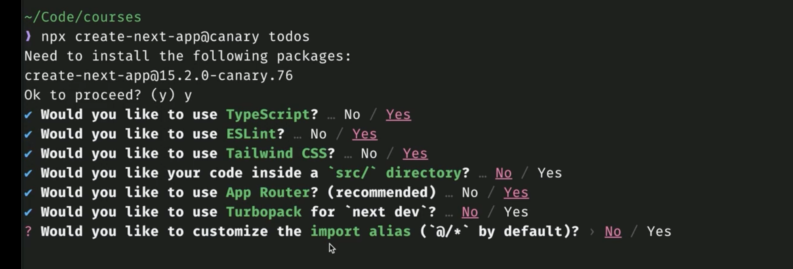
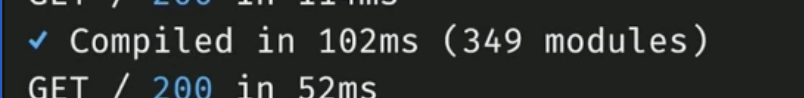

# Linear Clone

A project management application built with Next.js, inspired by Linear.

## Features

- User authentication (sign up, sign in, sign out)
- Issue management (create, update, delete)
- Modern UI with Tailwind CSS
- Responsive design

## Tech Stack

- [Next.js 13+](https://nextjs.org/) with App Router
- [TypeScript](https://www.typescriptlang.org/)
- [Tailwind CSS](https://tailwindcss.com/) for styling
- [Prisma](https://www.prisma.io/) for database ORM
- [PostgreSQL](https://www.postgresql.org/) for database
- [NextAuth.js](https://next-auth.js.org/) for authentication

## Getting Started



### Prerequisites

- Node.js 16+ and npm/yarn
- PostgreSQL database (or use a service like [Neon](https://neon.tech/))

### Installation

1. Clone the repository

   ```bash
   git clone https://github.com/yourusername/linear-clone.git
   cd linear-clone
   ```

2. Install dependencies

   ```bash
   npm install
   # or
   yarn install
   ```

3. Copy the `.env.example` file to `.env.local` and update the values

   ```bash
   cp .env.example .env.local
   ```

   https://www.instagres.com/

4. Set up your database and update the `DATABASE_URL` in `.env.local`

5. Run database migrations

   ```bash
   npx prisma db push
   ```

6. Start the development server

   ```bash
   npm run dev
   # or
   yarn dev
   ```

7. Open [http://localhost:3000](http://localhost:3000) in your browser

## Project Structure

- `app/` - Next.js App Router pages and layouts
- `app/api/` - API routes for authentication and issues
- `app/components/` - Reusable UI components
- `lib/` - Utility functions and libraries
- `prisma/` - Database schema and client

static routes
static information, dont change, nextjs prerendered this.

dynamic routes
typical have parameter on it

layouts
components that wrap pages and nnever change
layouts always inherits from another lyaout

route group

## Styling

use tailwind

## 05 static pages

'use client' is a directive. react feature: regular SPA application client side React.

this is how static pages works



this happens because

PAGES(static non static) are not rendered or execute(compiled) it by Next.js until I visit it in DEV mode (takes a while the first time, then it is ok to go)

static pages: regula rpages that dont fetch data or any dynamic data / not personalized to the user is looking at it
should be heavily optimized

if you want to prerender a lot of static pages (like 50 blog post, -> that they are not going to change)
you should use https://nextjs.org/docs/app/api-reference/file-conventions/dynamic-routes#generating-static-params

## 06 Server Actions / server functions

Async function that gets called on the server, but usually initiated in some interaction
something in the client happens and then the server action gets fired

is a more streamline way to create API routes without actually make api routes

Zod is a runtime schemas -> we can check an schema in runtime and gert an error or not

yuo should have form validation on the cliente and also in the route

### in actions/auth.ts

'use server' directive

every action that gets exported, is essentially an api route -> get bundled with the serverwith the server modules and not with the client modules

because this functions are about to execute on the server, means that they dont have cces to the window, thing on the client

you access server things on this files.

## 07 Auth forms server actions and react hook useActionState

we will use the server actions created, calling a
when you import the server actin to your client component, what you are importing is the handler (not the function itself)

no control input, not keep tracing load state,
it gives us the status, state of inputs

in signup:
add 'use client'
to be able to use hooks in a component (bc hooks run in the browser) this component is going to have some interactivity

you can use server actions in react query
react query takes any async func as a fetcher

useActionServer
useRouter -> how to use the router programatically

SignIn

## 08

go to lib/dal
Data access layer -> utility fucntons you can use in the server to fetch data, for server component. regular funcitons that happens before A ROUTE RENDERS . dont cross the network barrier. THEY ARE NOT IN CLIENT

is the first thing is get execute that user goes to a route that is a server component

SERVER ACTIONS are API routes that respond to a some interactions on the client

SERVER ACTIONS or functions is node code that is exposed by nextjs over http
data layer is native node code that never leaves the server

in lib/auth.ts
that node code is reading the headers that came in the request

in 08 lesson
you can add async to a react component -> to block rendering until something async is done

in dashboard component:
use cache or
wrap it into a Suspense --- fallback -> is the loading page.

Next.js is actively developing features to improve data fetching and caching in Server Components. Features like `dynamicIO`, currently available in the canary channel, offer more granular control over caching behavior. With `dynamicIO` enabled, Next.js, by default, will throw an error if a Server Component fetches data _without_ being wrapped in a `<Suspense>` boundary or utilizing the `use cache` directive. To handle dynamic data fetching during development, wrap the component fetching the data in `<Suspense>`. This opts that component out of caching, ensuring you always see the latest data.

use the suspense for developing , then decided what do you want to cache
